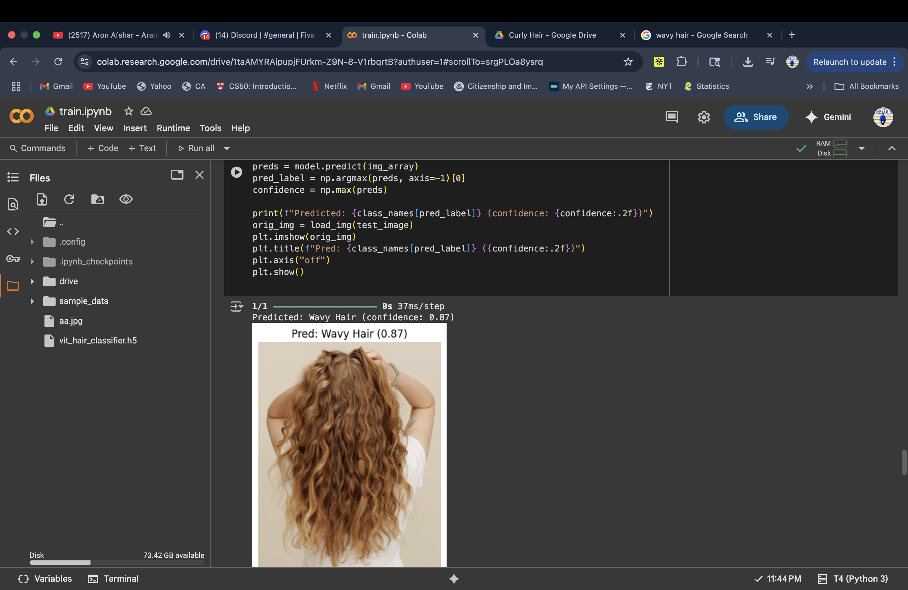

# Hair Classification Project

This project implements a Vision Transformer (ViT) model for classifying different hair types. The model can distinguish between three main hair categories: Curly Hair, Straight Hair, and Wavy Hair.

## Project Overview

The project uses a Vision Transformer architecture to classify hair types from images. The model has been trained on a dataset containing images of different hair textures and can predict the hair type of new input images.

## Model Architecture

- **Image Size**: 32x32 pixels
- **Patch Size**: 4x4 pixels (resulting in 64 tokens)
- **Embedding Dimension**: 192
- **Number of Attention Heads**: 3
- **MLP Ratio**: 4
- **Transformer Depth**: 6 blocks
- **Dropout Rate**: 0.1
- **Learning Rate**: 3e-4
- **Batch Size**: 128

## Dataset

The project uses the "The Three Hair Types" dataset, which contains images categorized into:
- **Curly Hair**: Natural curls and coils
- **Straight Hair**: Straight and sleek hair textures
- **Wavy Hair**: Hair with natural waves and texture

## Files

- `train.ipynb`: Jupyter notebook containing the model training code
- `app.py`: Script for downloading the dataset using Kaggle Hub
- `vit_hair_classifier.h5`: Trained model weights
- `test.png`: Sample test image for classification
- `README.md`: This documentation file

## Test Image Preview

Below is the test image used for model evaluation:

*Sample image used to test the hair classification model*

## Usage

1. **Training**: Run the `train.ipynb` notebook to train the Vision Transformer model
2. **Dataset Download**: Use `app.py` to download the required dataset from Kaggle
3. **Testing**: Load the trained model (`vit_hair_classifier.h5`) and classify the `test.png` image

## Requirements

- TensorFlow 2.x
- Keras
- NumPy
- Matplotlib
- PIL (Python Imaging Library)
- kagglehub

## Model Performance

The Vision Transformer model achieves good performance on hair type classification by:
- Using patch-based attention mechanisms
- Learning spatial relationships in hair textures
- Classifying images into one of three hair type categories

## Getting Started

1. Clone this repository
2. Install the required dependencies
3. Run `python app.py` to download the dataset
4. Open and run `train.ipynb` to train the model
5. Use the trained model to classify new hair images

---

*This project demonstrates the application of Vision Transformers for hair texture classification, showcasing how modern attention-based architectures can be applied to image classification tasks.*
